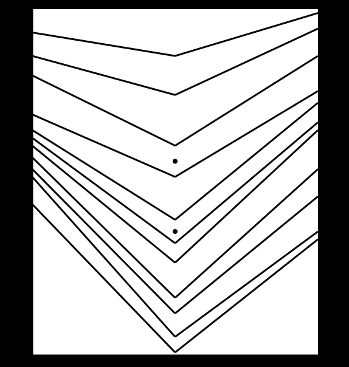
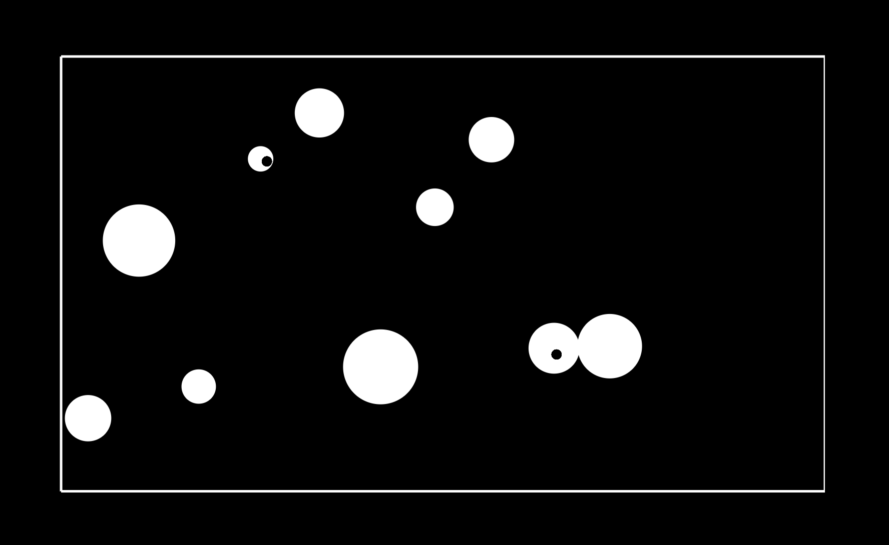
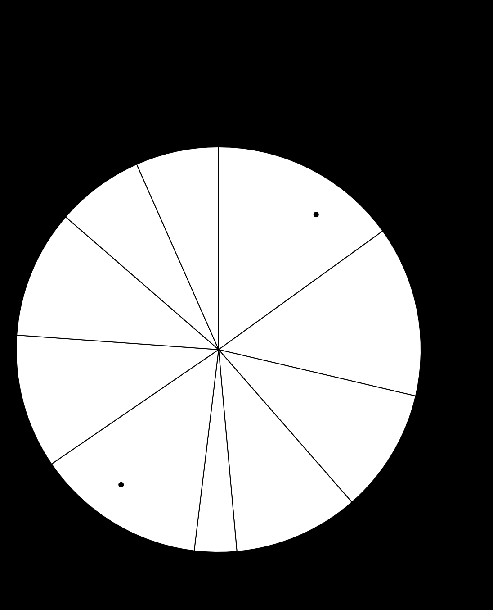
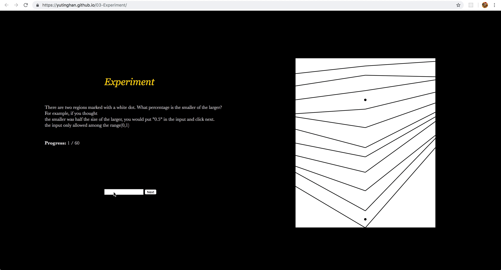
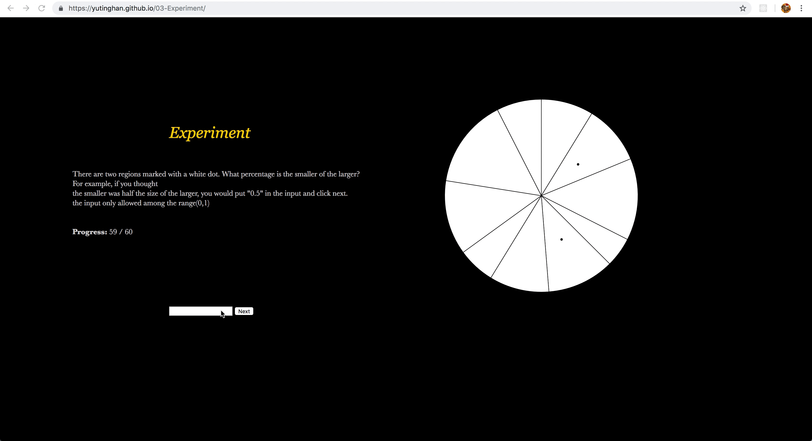

Assignment 3 - Replicating a Classic Experiment  
===
Meijie Wang, Yuting Han, Zhiyi Huang
-------

The experiment itself can be seen at this locations: 
https://yutinghan.github.io/03-Experiment

We decide to test human perception of graphic area during this replication of the seminal Cleveland Mcgill experiment, so choose these three different types of charts: Stacked Area Charts, Bubble Charts, and Pie Charts.Each participant was shown 20 variations of each type of chart, each with 10 randomly generated white regions, and two black dots randomly to compare the selected area.

Functions
===
For all the three functions we do, we set the range of the random data, and all difference between values in a set greater than 1, to make sure the readability for all the images.

Stacked Area Charts
------
In this chart, set three position dots in each line, the simple random data would leads to line crossing, it's hard to pick two selected areas to compare. So, the data we apply in this chart not untill set the range and difference, but also generated by using overlay method to solve this problem.
In particular, we set the second dot to be the highest in a line, to be more realistic.

Bubble Charts
-------
In this chart, we considered that participants may judge the radius of each bubble, a.k.a length instead of the area, may violate our design purpose. So, for the two dots in the bubble we don't set them at the centorid position to avoid that.  

Pie Charts
------

Show the experiment
===
Set the input should be among 0 to 1, when finished one image, click "Next" button to continue the experiment.
Display the progress throughout the experiment for participants to check out.
Display the introduction parts for participants to understand the experiment.
For the experiment, make some alertings for the paticipants, the below two gifs show that if the input outside the setting range, shows an invail input alert, and when finished whole test, show the work done. 

We also upload one example of the whole experiment video in the result file.

# 

Hypotheses
===
1.Participants will make more accurate measurements with the Bubble Chart than the Stacked Area Chart.
2.Participants will make more accurate measurements with the Pie Chart than the Bubble Chart.
3.Participants will make the least accurate measurements with the Stacked Area Chart.

Results
===
1). With all the experiment data we got, we got the conclusion base on our data that among these three different types of charts, human perception of graphic area works with Pie Chart, Bubble Chart and Stacked Area Chart in the descending order.
#
2). Among our hypotheses, all the three were confirmed. The results order of Pie chart, Bubble chart and Stacked Line Chart is same with the cleveland results below. 

#
3). However, except the order, we find that the real error we caculated has a huge difference with the cleveland results. The AverageError we got of Pie chart and Bubble chart are about 0.5 larger than cleveland results. 
#
4). Our experiment adhered to a between-subjects design. We excluded participants who incorrectly answered the story verification question, as well as those who either failed to answer or put the same answer for multiple questions. For example, the answer was 50% away from the correct answer and put all the 0.3 during the whole experiment.
#
5). We also follow previous studies in using bootstrapping to calculate the mean confidence intervals for each chart and
priming combination. The resulting confidence intervals are shown below.

#

Discussion 
------

Technical Achievements
===
Set the definite range of the random data for readability.
Pick the theme of area to test during this replication of the seminal Cleveland Mcgill experiment.
For differnet function generate differnet range of the data.
Consider the length and angle affection during the experiment and solve it.

Design Achievements
===
Display the progress throughout the survey to the participant.
Notifying the participant of invalid input.
alerting completion with a thank you message for the participant at the end of the experiment.
Aesthetically pleasing design.

Sourcesfor Inspiration:
-----
- Cleveland, W. S., & McGill, R. (1984). Graphical perception: Theory, experimentation, and application to the development of graphical methods. Journal of the American statistical association, 79(387), 531-554.
- Harrison, L., Skau, D., Franconeri, S., Lu, A., & Chang, R. (2013, April). Influencing visual judgment through affective priming. In Proceedings of the SIGCHI Conference on Human Factors in Computing Systems (pp. 2949-2958). ACM.

