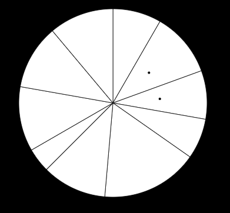

Assignment 3 - Replicating a Classic Experiment  
===
Meijie Wang, Yuting Han, Zhiyi Huang
-------

Survey Link: 
https://yutinghan.github.io/03-Experiment

A controlled experiment to test human perception of graphic area is built following the style from Cleveland and McGill's 1984 paper closely. Three competing visualizations are chosen: Stacked Area Chart, Bubble Chart and Pie Chart. In each chart, 10 randomly generated white regions are presented and 2 of them indicated by black dots are randomly chosen for area comparison.

This experiment is run with 20 trials per visualization type and is supported by 13 participants. To implement the performance, the error calculation function from Cleveland and McGill's 1984 paper is used.

Error=log2( | judged percent - true percent | + 1/8 )

The average error and Bootstrapped 95% confidence intervals are analyzed.

Three competing visualizations
===
Three competing visualizations are built by d3 and generated with random datasets.
When generating the random dataset, the lower and higher bounds are set to make sure the readability. 

Stacked Area Chart
------
Stacked area chart is often used to compare multiple variables' changing over an interval and the area bewtween lines is an important quantitative variable presented.

When building the visualization model, 11 lines are drawing to construct 10 areas and for simplicity, 3 points are created in each line.
To simulate the real data and reflect a trend, the middle point is set lower than the other two points.

Bubble Chart
-------
Bubble chart is a variation of a scatter chart and the areas of bubbles present one dimension of data.

To eliminate the interference that participants may judge the radius of each bubble rather than the area, the two black dots are draw at at random position rather than the center.

Pie Chart
------
Pie chart is one of the most commonly used chart and the areas of slices illustrate numerical proportions.

Experiment
===
Participants are asked to input the value that the smaller area over the larger area. The value ranges from 0 to 1 and the invalid value will be alerted.
There are 20 trials per chart and these 60 trials are presented in a random order.
Every time that the user clicks the "Next" button, the data will be stored and the next trial will appear.

When 60 trials finished, all data will be presented on the screen for the record.

Results
===
1). With all the experiment data we got, we got the conclusion base on our data that among these three different types of charts, human perception of graphic area works with Pie Chart, Bubble Chart and Stacked Area Chart in the descending order.
#
2). Among our hypotheses, all the three were confirmed. The results order of Pie chart, Bubble chart and Stacked Line Chart is same with the cleveland results below. 

#
3). However, except the order, we find that the real error we caculated has a huge difference with the cleveland results. The AverageError we got of Pie chart and Bubble chart are about 0.5 larger than cleveland results. 
#
4). We also follow previous studies in using bootstrapping to calculate the mean confidence intervals for each chart and
priming combination. The resulting confidence intervals are shown below.
#
5). Our experiment adhered to a between-subjects design. We excluded participants who incorrectly answered the story verification question, as well as those who either failed to answer or put the same answer for multiple questions. For example, the answer was 50% away from the correct answer and put all the 0.3 during the whole experiment.

#

Discussion 
------
1). Pie Chart area for human perception may also affect by the angle.
2). Due to the limit participants, time of participants paid in the experiment, the real results data may not consisitant exactly with previous work.

Technical Achievements
===
Set the definite range of the random data for readability.
Pick the theme of area to test during this replication of the seminal Cleveland Mcgill experiment.
For differnet function generate differnet range of the data.
Consider the length and angle affection during the experiment and solve it.

Design Achievements
===
Display the progress throughout the survey to the participant.
Notifying the participant of invalid input.
alerting completion with a thank you message for the participant at the end of the experiment.
Aesthetically pleasing design.

Sourcesfor Inspiration:
-----
- Cleveland, W. S., & McGill, R. (1984). Graphical perception: Theory, experimentation, and application to the development of graphical methods. Journal of the American statistical association, 79(387), 531-554.
- Harrison, L., Skau, D., Franconeri, S., Lu, A., & Chang, R. (2013, April). Influencing visual judgment through affective priming. In Proceedings of the SIGCHI Conference on Human Factors in Computing Systems (pp. 2949-2958). ACM.

